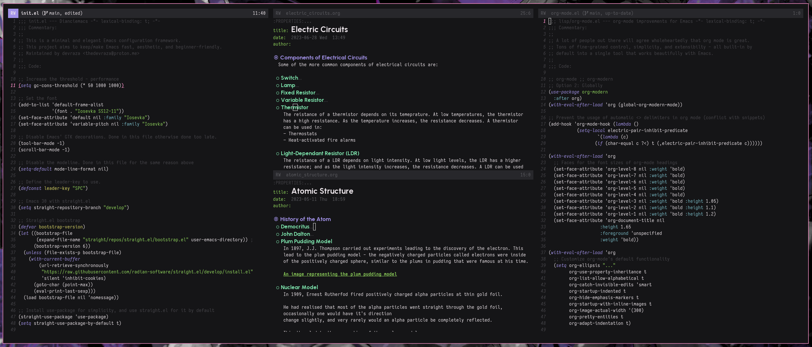

# 輝き (Kagayaki) for Emacs
This is a port of the `kagayaki` colorscheme for Emacs, made using [autothemer](https://github.com/jasonm23/autothemer).

This is the default theme for [`dianciemacs`](https://git.devraza.duckdns.org/devraza/dianciemacs) - rather, this theme was created specifically for it.

> **Note**: an independant variant of the theme (that is, one that does not rely on `autothemer`) has been produced by [Haider Mirza](https://github.com/Haider-Mirza). See the `independant` branch for details.

## Screenshots
From the DianciEmacs' `README.md`:

## Credits
- [Haider Mirza](https://github.com/Haider-Mirza) for an independant variant of the theme.
